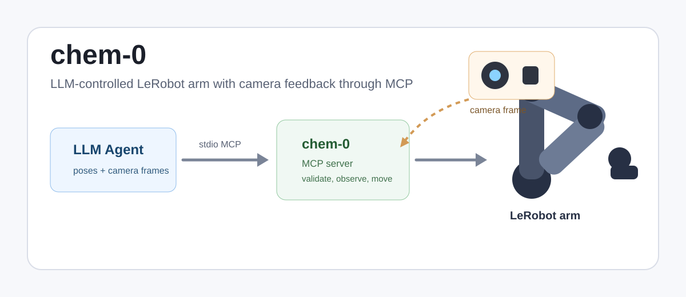

# chem-0



## A small research project in embodied laboratory automation

`chem-0` explores a practical question:

> Can a language-model agent safely operate a low-cost robot arm while using a
> live camera feed as its visual feedback loop?

This repository contains a compact stdio MCP server that lets an MCP-capable
agent, such as Codex, connect to a Hugging Face LeRobot SO-101/SO-100 follower
arm, inspect camera frames, read calibrated joint poses, and command the arm
through a six-parameter pose interface.

The project is intentionally small enough to understand at a science-fair table:

1. The robot arm is calibrated into a known coordinate space.
2. The camera returns a frame to the agent.
3. The agent receives a table of safe reference poses.
4. The agent chooses a target pose.
5. The MCP server validates the pose and moves the arm in small steps.

## Why This Matters

Many lab automation demos assume expensive industrial hardware, custom GUIs, or
hard-coded scripts. `chem-0` asks whether a simple open-source interface can
make robot control more inspectable:

- Every command is a named MCP tool call.
- Every full-arm movement is a six-number pose.
- Every pose is checked against calibrated limits.
- Every agent can read the same pose table before moving.
- Camera frames are available through the same MCP channel as motion commands.

That makes the system useful for studying agentic control, safety boundaries,
visual feedback, and the gap between language-model spatial reasoning and real
hardware.

## What Is In The Repo

```text
lerobot_mcp_server.py     Stdio MCP server for robot, camera, and pose tools
README.md                 Visitor-facing project overview
AGENTS.md                 Agent handoff and operating instructions
GEMINI.md                 Same as AGENTS.md
CLAUDE.md                 Same as AGENTS.md
docs/                     Detailed setup, operations, testing, and references
assets/                   Welcome image and future visual assets
```

## System Diagram

```text
MCP Client / LLM Agent
        |
        | stdio MCP
        v
chem-0 MCP Server
        |
        +-- OpenCV camera frame -> MCP image content
        |
        +-- LeRobot SO-101 follower arm
              |
              +-- Feetech STS3215 servo bus
```

## Core MCP Tools

The server exposes tools for discovery, vision, robot state, and movement:

- `list_cameras`
- `view_camera`
- `probe_feetech`
- `connect_so101`
- `observe`
- `get_pose_table`
- `move_pose`
- `move_relative`
- `disconnect`

It also exposes the MCP resource:

```text
lerobot://pose-table
```

That resource gives agents calibrated limits, units, orientation notes, and
common reference poses.

## Six-Parameter Pose Interface

The preferred motion interface is `move_pose`. It requires exactly six values:

```json
{
  "pose": {
    "shoulder_pan": -109,
    "shoulder_lift": 0,
    "elbow_flex": -70,
    "wrist_flex": 0,
    "wrist_roll": -164,
    "gripper": 0.5
  },
  "max_step": 5
}
```

Units:

- `shoulder_pan`: degrees
- `shoulder_lift`: degrees
- `elbow_flex`: degrees
- `wrist_flex`: degrees
- `wrist_roll`: degrees
- `gripper`: percent, `0..100`

By default, poses outside calibrated limits are rejected.

## Known Local Hardware Defaults

The current physical setup was tested with:

```text
robot id: mcp_so101
serial port: /dev/cu.usbmodem5AB01815731
camera id: 0
calibration: ~/.cache/huggingface/lerobot/calibration/robots/so_follower/mcp_so101.json
```

The last validated visual pose was approximately:

```text
shoulder_pan.pos:  about -109
shoulder_lift.pos: about 0
elbow_flex.pos:    about -70
wrist_flex.pos:    about 0
wrist_roll.pos:    about -164
gripper.pos:       about 0.5
```

## Quick Start

Install dependencies:

```sh
python -m venv .venv
.venv/bin/python -m pip install --upgrade pip
.venv/bin/python -m pip install 'lerobot[feetech]'
```

Run the server:

```sh
.venv/bin/python lerobot_mcp_server.py
```

Mount it in Codex:

```json
{
  "mcpServers": {
    "chem-0": {
      "command": "/Users/vibestartup/Code/lerobot-test/.venv/bin/python",
      "args": [
        "/Users/vibestartup/Code/lerobot-test/lerobot_mcp_server.py"
      ],
      "env": {}
    }
  }
}
```

Then ask the agent:

```text
Use the chem-0 MCP. Read lerobot://pose-table, list cameras, view camera 0,
probe the LeRobot servos, connect to the SO101 arm, observe the current pose,
then only use move_pose with max_step <= 5 and poses inside calibrated limits.
```

## Documentation

- [docs/setup.md](docs/setup.md): hardware and software setup
- [docs/mcp-tools.md](docs/mcp-tools.md): full tool contracts and examples
- [docs/pose-table.md](docs/pose-table.md): pose semantics and reference poses
- [docs/operations.md](docs/operations.md): safe operating workflow
- [docs/testing.md](docs/testing.md): validation commands and expected results
- [docs/troubleshooting.md](docs/troubleshooting.md): common hardware and camera issues
- [docs/research-notes.md](docs/research-notes.md): project framing and next experiments

## Current Status

Working and tested:

- camera discovery and JPEG frame capture
- Feetech servo probe for IDs `1..6`
- calibrated robot connection
- six-joint observation
- absolute no-op `move_pose` test
- incremental real movement through `move_pose`

Known limitation:

- The Feetech bus can intermittently drop a status packet immediately after
  motion. The server retries observations, but operators should still keep
  motions small and visually monitored.

## Repository

```text
https://github.com/JacobFV/chem-0
```
