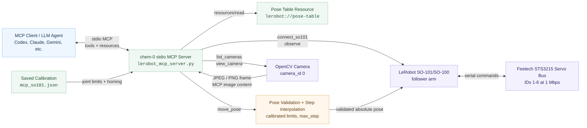

# Architecture

This diagram is the reusable source for the README architecture overview.

## Data Flow

1. The MCP client starts `lerobot_mcp_server.py` over stdio.
2. The client reads `lerobot://pose-table` for calibrated limits and reference poses.
3. The client calls `view_camera` to get visual context as an MCP image.
4. The client calls `probe_feetech`, `connect_so101`, and `observe`.
5. The client calls `move_pose` with a complete six-parameter pose.
6. The server validates the target and interpolates the move in small steps.
7. The server disconnects from the robot when the session is complete.
