# Architecture

`chem-0` is now centered on one shared TypeScript Node backend. The stdio MCP
server and the Electron GUI are clients of that backend; neither owns robot
state, experiment state, persistence, or agent streaming independently.

## Desiderata

- One backend for both MCP and Electron, so tool semantics and safety checks do
  not drift.
- A durable experiment model where each experiment has agent sessions,
  append-only `agent_session_events`, and artifact records.
- Local-first persistence: `data/chem0.sqlite` plus `data/blobs` beside it.
- MCP compatibility while accepting that MCP clients do not expose their full
  chat transcript to the server. MCP tools therefore accept `experiment_id` so
  tool calls and responses can still be attributed.
- Electron-first agent sessions, where the Node backend can stream GPT-5.5
  responses into the GUI and persist every message, tool call, tool response,
  artifact, and error as an event.
- Voice interaction should be available from the same backend tools whether the
  agent is hosted in Electron or connected through MCP.
- A small Python boundary for the pieces that are already mature in Python:
  LeRobot, Feetech, OpenCV, `placo`, and the repo-local URDF kinematics.

## System Diagram

```mermaid
flowchart LR
    agent["MCP Client / LLM Agent<br/>Codex, Claude, Gemini, etc."]
    desktop["Chem-0 Lab Console<br/><code>src/apps/electron</code>"]
    mcp["Node stdio MCP Server<br/><code>src/apps/mcp-node</code>"]
    backend["Shared Node Backend<br/><code>@chem0/backend</code>"]
    db["SQLite Experiment Store<br/><code>data/chem0.sqlite</code>"]
    blobs["Blob Store<br/><code>data/blobs</code>"]
    openai["OpenAI Responses API<br/><code>gpt-5.5</code>"]
    audio["Voice I/O<br/><code>speak_to_human</code><br/><code>listen_to_human</code>"]
    bridge["Python Bridge<br/><code>src/apps/python-bridge</code>"]
    core["Python Core<br/><code>src/lib/chem0</code>"]
    pose["Pose Table Resource<br/><code>lerobot://pose-table</code>"]
    ik["SO-101 FK / IK<br/><code>placo</code> + URDF"]
    safety["Validation + Step Interpolation<br/>joint limits, workspace, max_step"]
    expert["Expert Placeholder<br/><code>ask_export(question)</code>"]
    camera["OpenCV Camera<br/>camera_id 0"]
    robot["LeRobot SO-101/SO-100<br/>follower arm"]
    bus["Feetech STS3215 Servo Bus<br/>IDs 1-6 at 1 Mbps"]
    calib["Saved Calibration<br/><code>mcp_so101.json</code>"]

    agent <-->|"stdio MCP<br/>tools + resources"| mcp
    desktop <-->|"IPC<br/>streaming events + tool calls"| backend
    mcp <-->|"backend API"| backend
    backend -->|"experiments<br/>sessions<br/>events"| db
    backend -->|"camera/tool artifacts"| blobs
    backend <-->|"agent stream<br/>tool loop"| openai
    backend -->|"TTS/STT"| audio
    backend <-->|"JSON lines"| bridge
    bridge -->|"dispatch"| core
    core -->|"resources/read"| pose
    core -->|"list_cameras<br/>view_camera"| camera
    core -->|"connect_so101<br/>observe|get_arm_pose"| robot
    core -->|"get_position<br/>set_position"| ik
    ik -->|"IK joint target"| safety
    core -->|"set_arm_pose"| safety
    core -->|"ask_export"| expert
    safety -->|"validated joint action"| robot
    calib -->|"joint limits + homing"| core
    robot <-->|"serial commands"| bus

    classDef agent fill:#eef6ff,stroke:#8fbceb,color:#17324d
    classDef server fill:#f0f8f3,stroke:#92c8a0,color:#1f4d2d
    classDef core fill:#f2fbef,stroke:#8fbd76,color:#264d1a
    classDef safety fill:#fff7ec,stroke:#e0ad6e,color:#5d3d16
    classDef ik fill:#eefaf9,stroke:#79bbb4,color:#164d49
    classDef expert fill:#f7f7f7,stroke:#aaa,color:#333
    classDef hardware fill:#f4f1ff,stroke:#a99be8,color:#2f255f
    class agent,desktop agent
    class mcp,backend,bridge,db,blobs,openai,audio,pose,calib server
    class core core
    class safety safety
    class ik ik
    class expert expert
    class camera,robot,bus hardware
```

## MCP Affordance Map

```mermaid
flowchart TB
    client["MCP Client / Agent"]
    server["Shared Node Backend + MCP Surface"]

    discovery["Discovery<br/><code>list_serial_ports</code><br/><code>list_cameras</code>"]
    vision["Vision<br/><code>view_camera</code><br/>JPEG / PNG MCP image"]
    bus_tools["Servo Bus + Connection<br/><code>probe_feetech</code><br/><code>connect_so101</code><br/><code>disconnect</code>"]
    state["State + Context<br/><code>observe</code><br/><code>get_arm_pose</code><br/><code>get_pose_table</code><br/><code>lerobot://pose-table</code>"]
    joint_motion["Joint-Space Motion<br/><code>set_arm_pose</code><br/><code>move_relative</code>"]
    cart_motion["Cartesian Motion<br/><code>get_position</code><br/><code>set_position</code><br/>position-only IK"]
    gripper["Gripper<br/><code>open_gripper</code><br/><code>close_gripper</code>"]
    expert_tool["Expert Placeholder<br/><code>ask_export(question)</code><br/>returns expert not available"]
    voice["Human Voice<br/><code>speak_to_human</code><br/><code>listen_to_human</code>"]
    experiments["Experiments<br/><code>create_experiment</code><br/><code>list_experiments</code><br/><code>list_agent_session_events</code><br/><code>list_experiment_artifacts</code>"]

    client -->|"stdio MCP"| server
    server --> discovery
    server --> vision
    server --> bus_tools
    server --> state
    server --> joint_motion
    server --> cart_motion
    server --> gripper
    server --> expert_tool
    server --> voice
    server --> experiments

    classDef client fill:#eef6ff,stroke:#8fbceb,color:#17324d
    classDef server fill:#f0f8f3,stroke:#92c8a0,color:#1f4d2d
    classDef affordance fill:#fffdf7,stroke:#d2bd7d,color:#3d3416
    class client client
    class server server
    class discovery,vision,bus_tools,state,joint_motion,cart_motion,gripper,expert_tool,voice,experiments affordance
```

## Data Flow

1. Electron starts `@chem0/backend` in the Electron main process, or an MCP
   client starts `src/apps/mcp-node/dist/server.js` over stdio.
2. The Node backend initializes `data/chem0.sqlite`, `data/blobs`, and the
   persistent Python bridge process.
3. Electron-created sessions stream GPT-5.5 responses and backend tool-loop
   events into the GUI while appending each event to SQLite.
4. MCP-created tool calls pass through the same backend. When a call includes
   `experiment_id`, the backend logs `tool_call` and `tool_response` events.
5. Hardware calls are forwarded to the Python bridge, which dispatches to
   `src/lib/chem0/core.py`.
6. Voice tools can speak through ElevenLabs or macOS system speech and can
   transcribe Electron microphone clips or MCP-provided audio files.
7. Image responses from tools such as `view_camera` are copied into the blob
   store and referenced from `experiment_artifacts`.
8. Joint-space and Cartesian movement still route through calibrated validation
   and step interpolation before any hardware action is sent.
