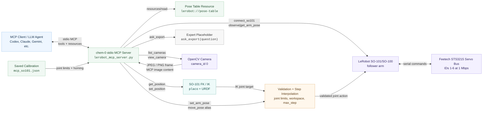
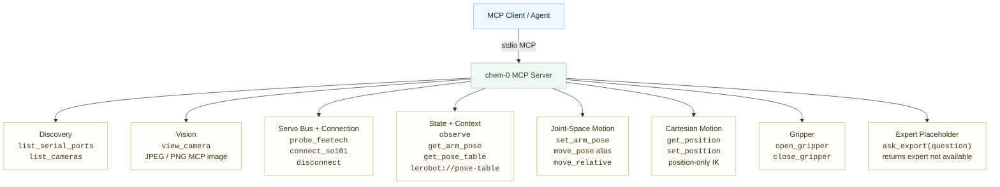

# Architecture

This diagram is the reusable source for the README architecture overview.

## MCP Affordance Map

This map enumerates every current MCP tool and resource by what it lets an
agent do.

## Data Flow

1. The MCP client starts `lerobot_mcp_server.py` over stdio.
2. The client reads `lerobot://pose-table` for calibrated limits and reference poses.
3. The client calls `view_camera` to get visual context as an MCP image.
4. The client calls `probe_feetech`, `connect_so101`, and `observe`.
5. The client calls `get_arm_pose`/`set_arm_pose` for joint-space motion or
   `get_position`/`set_position` for Cartesian IK.
6. The client may call `ask_export(question)` when it needs external expertise;
   the current placeholder returns `expert not available`.
7. The server validates the target and interpolates the move in small steps.
8. The server disconnects from the robot when the session is complete.
